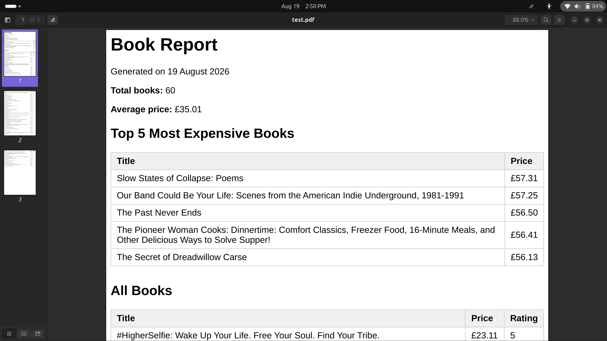

# PDF Report Generator

A backend pipeline that queries a small SQLite database, renders the results into a real PDF report using Playwright, and serves the finished file by link. Built for FlyRank Internship, Week 4, Assignment A8.

## Dataset

Uses the 60 real book records collected in [The Polite Scraper](https://github.com/shereef-M/scraper) (Assignment A9), scraped from books.toscrape.com. Each book has a title, price, star rating, and source URL.

## How to run

### 1. Install dependencies
\`\`\`bash
npm install
npx playwright install chromium
\`\`\`

### 2. Seed the database
\`\`\`bash
node seed.js
\`\`\`
This creates `report.db`, wipes any existing book rows (safe to run repeatedly — always leaves exactly one clean copy), and inserts the 60 books from `books.json`.

### 3. Start the API
\`\`\`bash
node index.js
\`\`\`
Server runs on `http://localhost:3000`.

### 4. Generate a report
\`\`\`bash
curl -X POST http://localhost:3000/reports
\`\`\`

## Aggregation SQL

Four queries power the report, in `report.js`:

\`\`\`sql
-- Total books
SELECT COUNT(*) as count FROM books

-- Average price
SELECT AVG(price) as avg FROM books

-- Top 5 most expensive books
SELECT title, price FROM books ORDER BY price DESC LIMIT 5

-- Number of books per star rating
SELECT rating, COUNT(*) as count FROM books GROUP BY rating
\`\`\`

## Endpoints

| Method | Path | Description |
| `GET` | `/health` | Health check |
| `POST` | `/reports` | Generates a report (or returns today's existing one), returns `201`/`200` + `id` + file link |
| `GET` | `/reports/:id` | Returns the report's metadata as JSON |
| `GET` | `/reports/:id/file` | Downloads the actual PDF |

## Download proof

\`\`\`bash
$ time curl -i -X POST http://localhost:3000/reports
HTTP/1.1 201 Created
{"id":1,"file":"/reports/1/file"}
real    0m0.471s

$ curl -o my-report.pdf http://localhost:3000/reports/1/file
100 32255  100 32255    0     0  1581k      0 --:--:-- --:--:-- --:--:-- 1657k
\`\`\`
The downloaded file opens as a real, 3-page PDF with no table row cut across a page break, and the header row repeats on every page.

## Stage 4 — feel the wait

At what point would I move this out of the request? At this scale (60 rows, ~0.5s), generation is fast enough to stay inline and the wait is barely noticeable for a single user clicking a button. With thousands of rows or many concurrent users, I'd move this to a background job (the A7 pattern) so `POST /reports` returns instantly with a `202` and a job id, and the client polls a status endpoint instead of holding the connection open — a request that takes seconds is fragile and keeps the user hostage.

## Stage 5 — idempotency

**What this protects against:** a user double-clicking "Generate report" (or a flaky network causing a retry) creating multiple identical PDFs for the same day, wasting disk space and confusing anyone looking at the report list.

**Real-world example:** an e-commerce platform sending a daily sales summary email — if "generate and send" isn't idempotent, a retried request could email the finance team the same report twice, or worse, silently generate two slightly different reports if the underlying data changed mid-retry.

Duplicate requests within the same day return the same `id` and produce exactly one new file:
\`\`\`bash
$ curl -X POST http://localhost:3000/reports
{"id":2,"file":"/reports/2/file"}
$ curl -X POST http://localhost:3000/reports
{"id":2,"file":"/reports/2/file"}
\`\`\`
Passing `{"force": true}` skips the check and always generates a fresh report.

## Report preview

## Report preview

